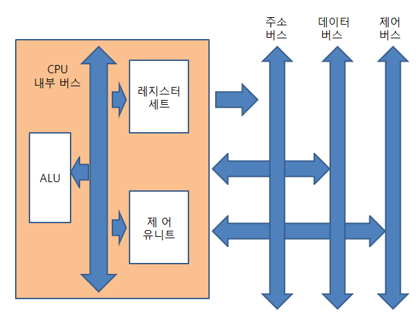
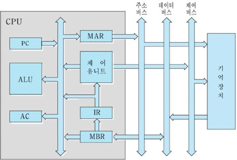

## CPU의 구조와 기능

CPU는 기억장치에 저장되어 있는 프로그램 코드인 명령어들을 실행함으로써 컴퓨터의 기본적인 기능(`프로그램 수행`)을 수행한다.

* 명령어 인출(Instruction fetch)
  * 기억장치로부터 명령어를 읽어온다.
* 명령어 해독(Instruction decode)
  * 수행해야 할 동작을 결정하기 위하여 명령어를 해독한다.
* 데이터 인출(Data fetch)
  * 명령어 실행을 위하여 데이터가 필요한 경우에는 기억장치 혹은 I/O 장치로부터 그 데이터를 읽어온다.
* 데이터 처리(Data process)
  * 데이터에 대한 산술적 혹은 논리적 연산을 수행한다.
* 데이터 저장(Data store)
  * 수행한 결과를 저장한다.

명령어 인출 및 명령어 해독의 경우 모든 명령어들에 대하여 공통적으로 수행되나, 나머지 동작들은 필요한 경우에만 수행된다는 특징이 있다.


### CPU의 기본 구조



* 산술논리연산장치 (Arithmetic and Logical Unit)
  * ALU라고 부른다.
  * 각종 산술 연산 및 논리 연산들을 수행하는 회로들로 이루어진 하드웨어 모듈을 말한다.
    * 산술 연산 : 덧셈, 뺄셈, 곱셈, 나눗셈
    * 논리 연산 : AND, OR, NOT 연산
* 레지스터 (Register)
  * CPU 내부에 위치한 기억장치이다.
  * 컴퓨터의 기억장치들 중에서 액세스 속도가 가장 빠르다.
  * 내부 회로가 복잡하여 비교적 큰 공간을 차지하기 때문에, 많은 수의 레지스터들을 CPU 내부에 포함시키기는 어렵다.
  * 위의 이유로 인하여 CPU에는 지정된 용도로만 사용되는 특수 목적용 레지스터들과, 적은 수의 일반 목적용 레지스터들만이 포함된다.
* 제어 유니트 (Control Unit)
  * 프로그램 코드 (명령어)를 해석하고, 그것을 실행하기 위한 제어 신호들(Control signals)을 순차적으로 발생하는 하드웨어 모듈이다.
    * 명령어 실행에 필요한 각종 정보들의 전송 통로와 방향을 지정
    * CPU 내부 요소들과 시스템 구성 요소들의 동작 시간도 결정
  * CPU가 제공하는 명렁어들의 수가 많아질수록 제어 유니트의 내부 회로는 더 복잡해짐
    * 제어 신호들의 종류와 발생 시간이 명령어마다 서로 다르기 때문
  * 복잡도를 줄이기 위해 제어 유니트의 동작을 소프트웨어로 처리해주는 마이크로프로그래밍 방법이 있으나, 최근에는 RISC(Reduced Instruction Set Computer) 설계 개념도 많이 사용되고 있다.
    * RISC의 경우 명령어의 수를 가능한 한 줄이고 명령어 형식을 단순화함으로써, 하드웨어만으로 명령어를 실행할 수 있도록 한다.
* CPU 내부 버스 (CPU internal bus)
  * ALU와 레지스터들 간의 데이터 이동을 위한 데이터 선들과 주소 선들, 그리고 제어 유니트로부터 발생되는 제어 신호들을 전송하는 선들로 구성된다.
  * 외부의 시스템 버스와는 직접 연결되지 않으며 반드시 버퍼 레지스터 혹은 인터페이스 회로를 통하여 접속된다.


### 명령어 실행

CPU는 기억장치에 저장되어 있는 명령어들을 인출하여 실행함으로써 실제적인 작업을 수행하게 되는데, 한 개의 명령어를 실행하는 데 필요한 전체 과정을 명령어 사이클(instruction cycle)이라고 부른다.

[참고 영상 1](https://www.youtube.com/watch?v=42KTvGYQYnA)

[참고 영상 2](https://www.youtube.com/watch?v=Mv2XQgpbTNE)

* 명령어 사이클 단계
  * 명령어 인출(instruction fetch)
  * 명령어 실행(instruction execution)
  * 시작 -> 명령어 인출 -> 명령어 실행 -> 중단 순으로 진행되며 각각의 부사이클을 인출 사이클 / 실행 사이클이라 부른다.
  * 명령어 인출 -> 명령어 실행 단계는 프로그램 실행을 시작한 순간부터 전원을 끄거나 회복 불가능한 오류가 발생되어 중단될 때까지 반복하여 수행된다.
* 명령어 실행에 필요한 레지스터
  * 프로그램 카운터(Program Counter)
    * PC라고 부른다.
    * 다음에 인출될 명령어의 주소를 가지고 있는 레지스터이다.
    * 각 명령어 인출 후에, 명령어 길이에 해당되는 주소 단위의 수만큼 레지스터 내용이 증가된다. (혹은 1)
    * 분기 (branch) 명령어가 실행되는 경우에는 그 목적지 주소로 갱신된다.
  * 누산기(Accumulator)
    * AC라고 부른다.
    * 데이터를 일시적으로 저장하는 레지스터이다.
    * 누산기의 비트 수는 CPU가 한 번에 연산 처리할 수 있는 데이터 비트의 수 (단어 길이)
  * 명령어 레지스터(Instruction Register)
    * IR이라고 부른다.
    * 가장 최근에 인출된 명령어가 저장되어 있는 레지스터이다.
  * 기억장치 주소 레지스터(Memory Address Register)
    * MAR이라고 부른다.
    * Program Counter에 저장된 명령어 주소가 시스템 주소 버스로 출력되기 전에 일시적으로 저장되는 주소 레지스터이다.
    * 이 레지스터의 출력 선들이 주소 버스 선들과 직접 접속된다.
  * 기억장치 버퍼 레지스터(Memory Buffer Register)
    * MBR이라고 부른다.
    * 기억장치에 저장될 데이터 혹은 기억장치로부터 읽혀진 데이터가 일시적으로 저장되는 버퍼 레지스터이다.
    * 이 레지스터의 입력 및 출력 선들은 데이터 버스 선들과 직접 접속된다.

주요 레지스터들과 데이터 통로가 표시된 CPU 내부 구조는 아래 그림을 참고.



#### 1) 인출 사이클

* 각 명령어 사이클의 시작 단계에서 Program Counter가 가리키는 기억장치의 위치로부터 명령어를 인출
* Program Counter의 내용을 1씩 자동 증가시켜줌으로써 명령어들을 기억장치에 저장되어 있는 순서대로 읽어올 수 있도록 함
* 명령어 인출에는 아래와 같이 세 개의 CPU 클록 주기만큼의 시간이 소요된다.

```
* t는 CPU 클록의 각 주기를 가리킴
* CPU의 클록 주파수가 1GHz라면 클록 주기가 1ns이므로, 인출 사이클은 1ns X 3 = 3ns가 소요된다.
t0 : MAR <- PC
t1 : MBR <- M[MAR], PC <- PC + 1
t2 : IR <- MBR

* t0 : 현재의 PC 내용을 CPU 내부 버스를 통하여 MAR로 보냄 -> 시스템 주소 버스와 직접 접속된 MAR을 통하여 주소가 기억장치로 전송
* t1 : 주소가 지정하는 기억장치 위치로부터 읽혀진 명령어가 데이터 버스를 통하여 MBR로 적재됨 + PC의 내용에 1을 더하여 다음 명령어의 주소를 가리키게 함
* t2 : MBR에 저장되어 있는 명령어 코드가 IR로 이동
```

#### 2) 실행 사이클

* 인출된 명령어 코드를 해독(decode)하고, 그 결과에 따라 필요한 연산을 수행
* 연산의 종류는 크게 네 가지로 분류된다.
  * 데이터 이동
  * 데이터 처리
  * 데이터 저장
  * 프로그램 제어

#### 3) 인터럽트 사이클

* 인터럽트(interrupt) : 프로그램 처리 중에 CPU로 하여금 순차적인 명령어 실행을 중단하고 다른 프로그램을 처리하도록 요구할 수 있는 메커니즘

  * main program의 관점에서는 단순히 정상적인 프로그램 처리 흐름을 방해하는 동작이다.
  * 정전과 같은 긴급한 상황에 대처하거나 외주 장치들과의 상호 작용을 위하여 반드시 필요한 기능

* CPU가 어떤 프로그램을 순차적으로 수행하는 도중에 외부로부터 인터럽트 요구가 들어오게 되면, 원래 프로그램 수행을 중단하고 인터럽트 서비스 루틴(ISR)을 먼저 수행하게 됨

  * 인터럽트에 대한 처리가 끝나면 ISR을 종료하고 다시 복귀하여 프로그램 수행을 진행

* 인터럽트 요구를 인식할 수 있어야 하기 때문에, 명령어의 실행 사이클을 종료하고 다음 명령어를 위한 인출 사이클을 시작하기 전에는 인터럽트 요구 신호가 들어와서 대기 중인지 검사해야 한다. 인터럽트 요구가 들어온 경우 아래와 같은 동작을 수행한다.

  * 다음에 실행할 명령어의 주소를 가리키는 현재의 Program Counter 내용을 Stack에 저장 -> 해당 ISR을 호출하기 위하여 루틴의 시작 주소를 PC에 적재 (시작 주소는 요구한 장치로부터 전송되거나 미리 정해진 값으로 결정됨)

* 이렇게 인터럽트 요구가 들어왔는지 검사하고, 그 처리에 필요한 동작들을 수행하는 과정을 `인터럽트 사이클`이라고 한다.

  [참고 링크](http://www.harucat.com/10)

#### 4) 간접 사이클 (indirect cycle)

* 실행 사이클에서 사용될 데이터의 실제 주소를 기억장치로부터 읽어오는 과정을 말한다.
  * 데이터에 대한 연산을 수행하는 경우에, 데이터가 기억장치에 저장되어 있다면 명령어에는 그 데이터를 읽어오기 위한 기억장치 주소가 포함되어 있다.
  * 어떤 명령어의 경우에는 포함하고 있는 주소가 데이터가 저장된 기억 장소의 주소를 가리킨다. 이와 같은 경우, 간접 사이클을 수행하여 데이터의 실제 주소를 읽어와야 한다.
* 간접 사이클은 인출 사이클과 실행 사이클 사이에 위치
* 간접 주소지정 방식(indirect addressing mode)에서 간접 사이클이 사용된다.

```
t0 : MAR <- IR(addr)
t1 : MBR <- M[MAR]
t2 : IR(addr) <- MBR
```

