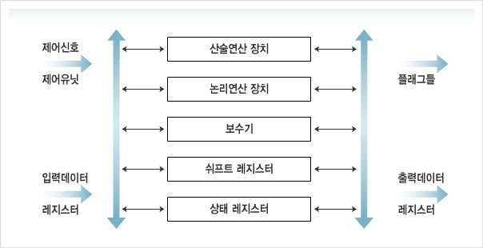

## 컴퓨터 산술과 논리 연산

* 산술적 계산은 일반적으로 정수와 부동소수점 수라는 두 가지 형태의 수들에 대하여 수행
* 논리 연산은 0과 1의 배열로 표현되는 2진 데이터에 대하여 이루어짐


### ALU의 구성 요소

* CPU의 내부 구성 요소들 중 하나인 ALU는 수치 및 논리 데이터에 대하여 실제적으로 연산을 수행하는 하드웨어 모듈이다.
  * 제어 유닛, 레지스터, 기억장치 및 입출력 장치는 결국 ALU에 의해 처리될 데이터를 가져오거나, 그 결과를 저장하고 출력시키는 역할을 한다고 볼 수 있음
* ALU의 내부 요소는 산술연산장치, 논리연산장치, 시프트 레지스터(Shift Register), 보수기(Complementer), 상태 레지스터(Status Register)가 있다.
  * 산술연산장치 : 산술 연산들(사칙연산)을 수행
  * 논리연산장치 : 논리연산들을 수행
  * 시프트 레지스터 : 비트들을 좌/우측으로 이동시키는 기능을 수행
  * 보수기 : 데이터에 대해 2의 보수를 취함 -> 데이터를 음수화 하는 것임 (1의 보수, 2의 보수..)
  * 상태 레지스터 : 연산 결과의 상태를 나타내는 플래그를 저장
* 레지스터 or 기억장치에서 ALU로 처리될 데이터가 입력되고, 레지스터들 중에서 하나에 그 결과가 저장된다.
* ALU는 연산 결과에 따라 상태 레지스터내의 해당 플래그들을 세트하고, 이 플래그들은 조건 분기 명령어 또는 산술 명령어들에 의해 사용된다.
* 입력 데이터에 대하여 연산을 수행할 내부 요소의 선택과 ALU 내외로의 데이터 이동을 제어하는 신호는 제어 유닛으로부터 제공





### 정수의 표현

2진수 체계에서는 어떤 수를 0과 1, 부호 및 소수점으로 표현한다.

```
10진수 -13.625 -> 2진수 -1101.101
```

하지만 실제로 컴퓨터가 처리하는 과정에서는 부호 및 소수점을 사용할 수 없고 0과 1만 이용해서 표현해야한다. 양수 / 음수를 나타내는 부호도 0과 1로 처리하며, 소수점 같은 경우 필요에 따라 특정 위치에 있는걸로 가정하고 표현하게 된다.

* 2진 소수점 (binary point) : 2진수 표현에서의 소수점으로서, 자릿수가 1보다 더 큰 수와 더 작은 수의 경계점
* 자릿수 (weight) : 수 표현에 사용된 2진 비트들의 위치에 따른 10진 값으로서, 가중치라고도 함
* 부호 비트 (sign bit) : 수가 양수인지 음수인지 나타내는 비트로서, 2진수의 맨 좌측 비트가 사용되며 0은 양수 / 1은 음수를 나타냄
  * 컴퓨터는 양수뿐만 아니라 음수도 처리하기 때문에 그 표현 방법이 필요한데, 2진수의 맨 좌측 비트 (leftmost bit)가 부호 비트로 사용된다는 점이 공통적이다.
  * 부호 비트가 0이면 양수, 1이면 음수이다.
  * 부호 비트를 사용하는 2진수 표현은 부호화-크기 표현, 1의 보수 표현, 2의 보수 표현이 있다.


#### 부호화-크기 표현

* 수를 표현하는 단어의 비트 수가 n이면, 맨 좌측 비트가 부호 비트이고 나머지 (n-1)개의 비트들은 수의 크기를 나타내는 방식

* 수의 크기 부분은 정수에 대한 2진수 표현과 같은 방식으로 변환

  ```
   15 = 0 0001111                     37 = 0 0100101
  -15 = 1 0001111                    -37 = 1 0100101
  ```

* 부호 비트에 대한 처리를 제외하면 2진수를 10진수로 변환하는 방법은 동일하고, 부호 비트를 사용하는 방식 중에 제일 간단하다.

* 덧셈과 뺄셈을 수행하기 위하여 부호 비트 / 크기 부분을 별도로 처리해야되는 문제점과, 0에 대한 표현이 두 가지라는 단점이 있다.


#### 보수 표현

* 부호화-크기 표현의 결점들을 해결하기 위하여 개발됨

* 1의 보수와 2의 보수 모두 표현한 결과는 동일하지만 음수화 방법에 있어서 차이점을 보인다.

  * 1의 보수의 경우 모든 비트들을 반전하고, 2의 보수는 그 상태에서 결과값에 1을 더한다는 차이가 있다.

  ```
  15 = 0 0001111
  -15(1의 보수) = 1 1110000
  -15(2의 보수) = 1 1110000 + 1 = 1 1110001
  ```

  * 2의 보수가 1의 보수에 비해 표현 가능한 개수가 1개 많다.
    * 부호화-크기 표현과 1의 보수의 경우 0에 대한 표현이 두 가지지만, 2의 보수는 한 가지이기 때문
    * 8비트 2진수로 표현 가능한 10진수의 범위는 1의 보수의 경우 -127~127, 2의 보수는 -128~127

#### 부호-비트 확장

어떤 수가 기억장치에 저장되어있을 때의 길이와 CPU 연산 과정에서의 길이가 서로 다른 경우가 있다. 그로 인하여 2의 보수를 더 긴 단어로 확장할 때, 부호 비트를 상위 비트들로 복제하는 동작을 부호-비트 확장(sign-bit extension)이라고 한다.

양수의 경우에는 모든 상위 비트들을 0으로 세트하고, 음수의 경우에는 확장되는 상위 비트들을 1로 세트한다.

```
23 = 00010111 (8비트 2의 보수) -> 23 = 0000000000010111 (16비트 2의 보수)
-23 = 11101001 (8비트 2의 보수) -> -23 = 1111111111101001 (16비트 2의 보수)
```

이렇게 표현된 정수 표현들을 고정소수점 수(fixed-point number)라고 부르기도 한다.


### 논리 연산

* 논리적 데이터에서는 단어 내의 각 비트 단위로 의미를 가지며, 연산도 비트 단위로 처리됨

1. AND 연산 (양쪽이 1인 경우에만 1)

   ```
   A = 10110101
   B = 00111011
   ------------
       00110001
   ```
2. OR 연산 (어느 한쪽이 1이면 1)

   ```
   A = 10110101
   B = 00111011
   ------------
       10111111
   ```
3. XOR 연산 (어느 한쪽만 1인 경우 1)

   ```
   A = 10110101
   B = 00111011
   ------------
       10001110
   ```
4. NOT 연산 (모든 비트를 반전)

   ```
   A = 10110101
   ------------
       01001010
   ```
5. 선택적-세트(selective-set) 연산 (특정 비트들을 1로 채우기 위한 OR 연산)

   ```
   A = 10110101
   B = 00001111
   ------------
       10111111
   ```
6. 선택적-보수(selective-complement) 연산 (특정 비트들을 보수화 하기 위한 XOR 연산)

   ```
   A = 10110101
   B = 00001111
   ------------
       10111010
   ```
7. 마스크(masking) 연산 (특정 비트들을 0으로 채우기 위한 AND 연산)

   ```
   A = 11110101
   B = 00011111
   ------------
       00010101
   ```
8. 삽입(insert) 연산 (특정 비트들을 새로운 값으로 대체하기 위한 마스크+OR 연산)

   ```
   A 레지스터의 10010101 값의 상위 4비트를 1110으로 대체하기
   A = 10010101
   B = 00001111 (AND)
   ------------
       00000101
       11100000 (OR)
   ------------
       11100101
   ```
9. 비교(compare) 연산 (두 레지스터들 간에 수행되는 XOR 연산)

   ```
   A = 10110101
   B = 10010110
   ------------
       00100011
   ```


### 시프트 연산

* 논리적 시프트 (logical shift)
  * 레지스터 내의 데이터 비트들을 왼쪽 or 오른쪽으로 한 칸씩 이동시키는 것을 말함
  * 왼쪽 시프트 연산을 하는 경우 비트들이 왼쪽으로 한 칸씩 이동되고, 마지막 비트는 0으로 채워진다.
    시프트로 밀려난 비트는 버려진다. (우측 시프트의 경우 반대)
  * 왼쪽 시프트 연산은 원래의 수를 2로 곱한 결과가 되며, 오른쪽 시프트 연산은 원래의 수를 2로 나눈 결과가 된다.
  * 시프트 레지스터 (shift register) : 데이터 비트들을 좌측 혹은 우측 뱡항으로 이동시키는 기능을 가지고 있는 레지스터

* 순환 시프트 (circular shift)
  * 기본 원리는 논리적 시프트 연산과 같으나, 최상위 or 최하위 비트를 버리지 않고 반대편 끝으로 이동시킨다는 차이점이 있다.
  * 두 레지스터간에 직렬 데이터 전송을 할 때 사용

* 산술적 시프트 (arithmetic shift)
  * 부호를 가진 정수에 대해 부호 비트를 고려하여 수행되는 시프트 연산을 말함

  * 따라서 부호 비트는 변경되지 않도록 해야 하고, 수의 크기를 나타내는 비트들만 시프트 처리한다.

    ```
    A = 1 110 (-2)
    산술적 좌측 시프트 연산 수행 -> 1 100 (-4)
    산술적 우측 시프트 연산 수행 -> 1 110 (-2)
    산술적 우측 시프트 연산 수행 -> 1 111 (-1)
    ```

* C 플래그를 포함한 시프트 연산

  * 실제 CPU에서는 올림수 플래그(C 플래그) 가 포함되는데, C 플래그를 포함한 좌측 시프트 연산을 하게 되면 최상위 비트가 버려지지 않고 C 플래그로 이동하게 된다.
    C 플래그를 포함한 우측 시프트 연산을 하게 되면 C 플래그의 값이 최상위 비트로 이동하게 되고, 최하위 비트는 버려진다.