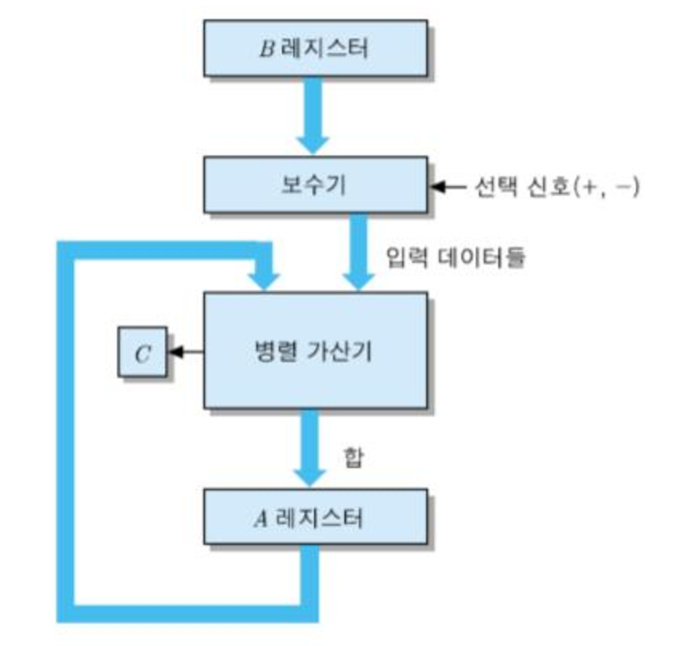
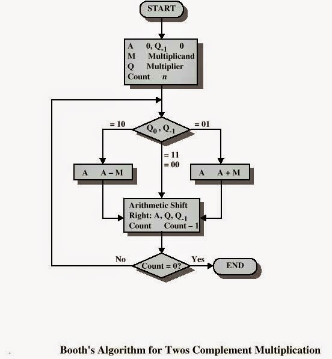

## 정수의 산술 연산

* 컴퓨터가 처리하는 기본적인 산술 연산의 종류
  * 보수화 (2의 보수 변환)
  * 덧셈, 뺄셈, 곱셈, 나눗셈
  * 증가(increment), 감소(decrement)


#### 덧셈

* 2의 보수로 표현된 두 수를 더하는 경우, 우선 두 수를 더하고 올림수를 버림

  * 덧셈 결과값의 부호가 1인 경우, 2의 보수로 표현된 음수를 나타냄

  * 병렬 가산기(parallel adder) : 여러 비트들로 이루어진 두 개의 데이터에 대한 덧셈을 수행하는 회로

    (비트 수 만큼의 전가산기들로 구성되어 있음)

  ```
  5 + 1 = 6
      0101
  +   0001
  ------------
      0110 (6)
      
  2 + (-7) = -5
      0010
  +   1001
  ------------
      1011 (-5)
      
  (-6) + (-1) = -7
      1010
  +   1111
  ------------
     11001
     1 버림
     ---------
      1001 (-7)
  ```

* 덧셈 결과가 데이터의 표현 범위 (수의 표현 범위)를 초과하는 경우 오버플로우(overflow)가 발생

  * 오버플로우(overflow) : 계산 결과값이 표현 범위를 초과하는 경우 발생하는 오류

  * 아래 예시의 경우 4비트 데이터의 표현 범위를 초과하기 때문에 오버플로우가 발생함

    ```
    5 + 4 = 9
      0101
    + 0100
    ----------
      1001 (-7) --> overflow
    ```


#### 뺄셈

* 정수들의 뺄셈은 감수를 음수화 한뒤, 피감수와 더하는 식으로 수행

  * 2의 보수로 표현된 수의 경우에도 동일 (감수의 2의 보수를 구하고, 피감수와 덧셈 수행)
  * 올림수는 덧셈과 마찬가지로 버림 처리

  ```
  4 - 5 = 4 + (-5) = -1
      0100
  +   1011
  -------------
      1111 (-1)
      
  6 - 1 = 6 + (-1) = 5
      0110
  +   1111
  -------------
     10101
     1 버림
     ----------
      0101 (5)
  ```


* 덧셈을 이용하여 뺄셈을 수행하기 때문에, 별도의 회로를 두지 않고 병렬 가산기를 이용한 계산을 수행
* 덧셈과 뺄셈 겸용 회로의 블록 구성도



* 뺄셈도 덧셈 과정과 마찬가지로 표현 가능한 범위를 초과하는 경우에는 오버플로우 발생


#### 곱셈
* 곱셈은 덧셈/뺄셈에 비하여 연산 처리가 복잡함
  * 부호 없는 정수의 경우 간단한 곱셈 처리방법이 있으며, 2의 보수로 표현된 수의 곱셈은 대표적으로 Booth Algorithm이 있음

* 부호 없는 정수를 곱하는 방법
  * 승수의 각 비트에 대하여 검사한 뒤, 피승수를 해당 비트에 곱하여 부분 적(partial product)을 만듦
    * 승수가 0인 경우 부분 적은 0000, 승수가 1인 경우 부분 적은 피승수와 같음
    * 승수의 각 비트에 대하여 한 자리씩 좌측으로 시프트 하면서 발생되는 부분 적들을 모두 더하면 곱셈의 결과를 얻을 수 있음

  ```
          1001 (9)
       X  1101 (13)
    ----------
          1001
         0000
        1001
       1001
    ----------
       1110101 (117)
  ```

* Booth 알고리즘 (2의 보수 곱셈)

  * [참고](http://zakarum.tistory.com/entry/Booths-Algorithm)
  * [참고2](https://people.cs.pitt.edu/~jmisurda/teaching/cs447/examples/Booth%20Example.pdf) 
    


#### 나눗셈

* 곱셈과 비슷한 원리를 가지고 있음
  * 반복적인 시프트와 덧셈 or 뺄셈으로 이루어져 있음

* 부호 없는 정수를 나누는 방법
  * 피제수의 비트를 좌측에서부터 우측으로 차례대로 검사
  * 비트들이 나타내는 값이 제수보다 같거나 큰 경우가 될 때(제수가 피제수를 나눌 수 있게 될 때)까지 한 비트씩 이동하면서 검사 반복
  * 몫으로는 좌에서 우로 가면서 0을 채우고, 나눌 수 있게 되면 몫의 해당 비트를 1로 쓴 뒤에 부분 피제수의 값에서 제수를 뺌 (이 결과를 부분 나머지 수라고 부른다)
  * 각 사이클에서 피제수로부터의 한 비트씩이 부분 나머지 수에 추가되고, 결과값이 제수와 같거나 커질 때까지 과정을 반복
    * 새로운 부분 나머지 수를 얻기 위하여, 그 수로부터 제수를 빼고 이 과정을 피제수의 모든 비트들에 적용될 때까지 반복

  ```
       00001101 (몫)
       --------
  1011|10010011 (제수, 피제수)
       -1011
       --------
       001110   (부분 나머지 수)
        -1011
       --------
         001111 (부분 나머지 수)
          -1011
          -----
            100 (나머지 수)
  ```

  ​