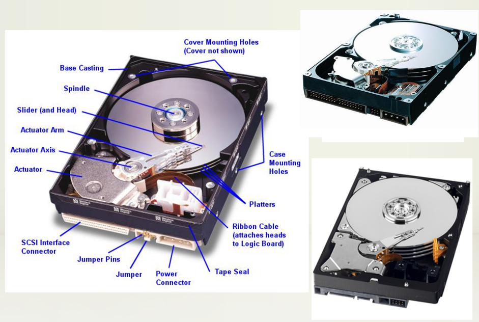
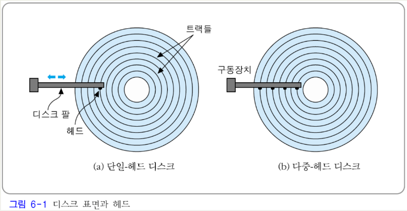
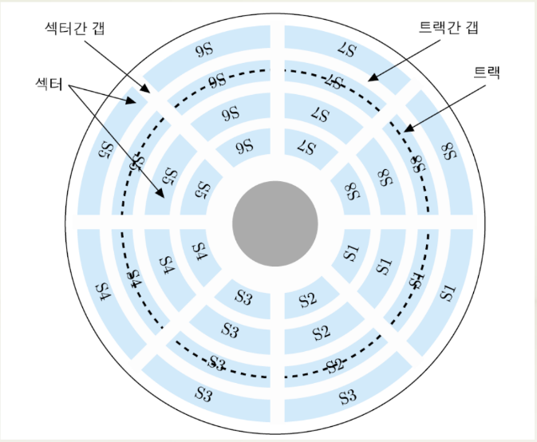
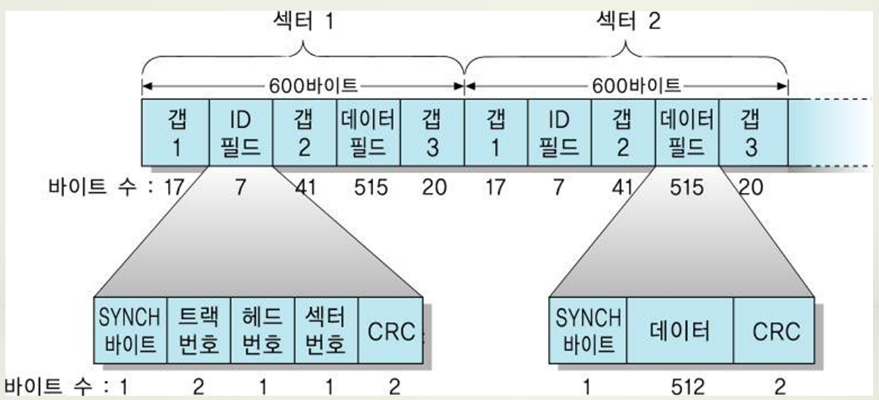
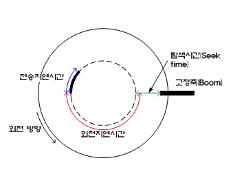

## 보조저장장치

#### 자기 디스크 (masnetic disk)

*   자화될 수 있는 물질로 코팅된 플라스틱이나 금속을 이용한 원형 평판으로 만들어진 저장장치 : 하드 디스크(hard disk), 디스크(disk)

*   주요 구성 요소들

    *   원형 평판(circular platter) : 실제 정보가 저장되는 장소로서, 다수의 트랙(track)들로 구성
    *   헤드(head) : 전도성 코일을 통하여 표면을 자화(magnetize) 시킴으로써 데이터를 저장하는 장치
    *   디스크 팔(disk arm) : 헤드를 이동시키는 장치
    *   구동장치(actuactor) : 디스크 팔을 움직이는 모터 (motor)



*   헤드의 수에 따른 디스크의 분류

    *   단일-헤드 디스크(single-head disk)
    *   다중-헤드 데스크(multiple-head disk)

    

    ​

*   헤드의 이동성에 따른 분류

    *   이동-헤드 디스크(movable-head disk)
        *   단일-헤드 디스크(single-head disk) : 헤드를 이동시키면서 디스크 표면의 데이터를 액세스
        *   다중-헤드 디스크(multiple-head disk) : 각 헤드에게 일정 트랙 그룹 할당 -> 헤드 이동 거리 단축
    *   고정-헤드 디스크(fixed-head disk)
        *   각 트랙 당 헤드를 한 개씩 설치
        *   탐색 시간 = 0
        *   제작 비용이 높아짐


#### 디스크의 구조

*   섹터(sector) : 디스크에 한 번에 쓰거나 읽는 데이터 크기의 최소 단위
*   섹터간 갭(inter-sector gap) : 섹터들을 구분하기 위한 간격(gap)
*   트랙간 갭(inter-track gap) : 헤드가 잘못 정렬되거나 자장의 간섭 때문에 발생하는 오류를 방지하기 위한 트랙들 사이의 간격
*   전형적인 디스크의 경우, 표면당 트랙의 수 = 500 ~ 2000개, 트랙당 섹터의 수 = 32개




*   등각속도 (Constant Angular Velocity, CAV)

    *   디스크가 일정한 속도로 회전하는 상태에서 트랙의 위치에 상관없이 데이터를 동일한 비율로 액세스하는 방식
        *   장점 : 디스크 읽기/쓰기 장치가 간단하다.
        *   단점 : 저장 공간이 낭비된다 (바깥쪽 트랙이 안쪽 트랙보다 더 길지만, 저장하는 데이터 양은 같아야 하기 때문)

*   디스크 형식화 작업 (disk formatting)

    *   디스크의 구성을 검사하고, 그에 관한 정보와 트랙의 시작점, 섹터의 시작과 끝을 구분하기 위한 제어 정보 등을 디스크상의 특정 위치에 저장하는 과정
    *   트랙 형식의 예
        *   섹터 크기 = 600 바이트 (512바이트 데이터 + 제어 정보)
        *   제어 정보(ID 필드) : 섹터를 구분하는 데 필요한 식별자 또는 주소
            *   SYNCH 바이트, 트랙 번호, 헤드 번호, 섹터 번호, 오류 검출 코드

    

*   디스크 드라이브 (disk drive)

    *   디스크, 헤드가 부착된 디스크 팔, 구동장치, 디스크를 회전시키는 축(spindle), 데이터 전송을 위한 전자 회로 등을 포함한 전체 패키지
    *   디스크 이동성에 따른 분류
        *   제거불가능 디스크(non-removable disk) : 디스크 드라이브 내에 고정시킨 디스크 (하드 디스크)
        *   제거가능 디스크(removable disk) : 디스크 드라이브로부터 꺼낼 수 있으며, 다른 디스크 드라이브에 삽입시켜 데이터를 읽거나 쓸 수 있는 디스크 (플로피 디스크(floppy disk))
    *   디스크 면 수에 따른 분류 : 양면 디스크(double-sided disk), 단면 디스크(single-sided disk)
    *   실린더(cylinder) : 서로 다른 디스크 표면에 있지만 같은 반경에 위치하고 있어서, 디스크 팔을 움직이지 않고도 동시에 액세스할 수 있는 트랙들의 집합

*   디스크 액세스 시간

    *   디스크 액세스(읽기/쓰기) 동작의 순서

        1) 헤드를 해당 트랙으로 이동

        2) 원하는 섹터가 헤드 아래로 회전되어 올 때까지 대기

        3) 데이터를 전송

    *   디스크 액세스 시간(disk access time)

        *   디스크 액세스 시간 = 탐색 시간 + 회전 지연 시간 + 데이터 전송 시간
        *   탐색 시간(seek time) : 1번에 걸리는 시간
        *   회전 지연 시간(rotational latency time) : 2번에 걸리는 시간
        *   데이터 전송 시간(data transfer time) : 3번에 걸리는 시간 및 디스크 제어기(disk controller)에서 소요되는 시간

    

    *   회전지연시간 : 디스크의 회전속도에 따라 결정

        *   예 : 회전축의 속도 = 7200rpm(rotations per sec)인 경우, 초당 120바퀴 회전 -> 한 바퀴 회전에는 1/120sec(8.33ms) 소요.

            헤드가 해당 트랙에 도착한 순간의 헤드 위치에 따라,

             - 회전지연시간 : 0~8.33ms
            - 평균 회전시간 : 4.17ms(1/2 바퀴 회전에 걸리는 시간)

    *   최근의 디스크 회전축 속도 : 5400rpm, 7200rpm, 10000rpm, 15000rpm, ...

    ``` 
    * 예제
    어떤 디스크의 탐색 시간이 8ms, 전송률이 100[MByte/s]이고, 회전축의 속도가 5400rpm, 그리고 제어기의 지연시간은 1ms라고 가정한다. 섹터의 크기가 512바이트인 경우에, 한 섹터를 읽거나 쓰는 데 걸리는 평균 액세스 시간을 구하라.

    * 풀이
    평균 회전 지연시간 : {1 / (5400 / 60)} * 0.5바퀴 ≒ 5.5ms
    Ta = 8ms + 5.5ms + (0.5KByte / 100MByte/s) + 1ms ≒ 14.5ms
    ```

    ​

