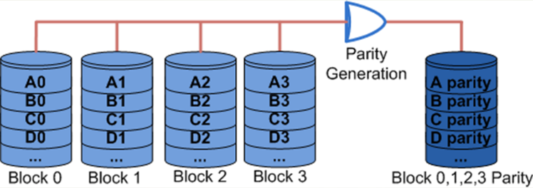

## 보조저장장치

#### 자기 디스크 (masnetic disk)

*   자화될 수 있는 물질로 코팅된 플라스틱이나 금속을 이용한 원형 평판으로 만들어진 저장장치 : 하드 디스크(hard disk), 디스크(disk)

*   주요 구성 요소들

    *   원형 평판(circular platter) : 실제 정보가 저장되는 장소로서, 다수의 트랙(track)들로 구성
    *   헤드(head) : 전도성 코일을 통하여 표면을 자화(magnetize) 시킴으로써 데이터를 저장하는 장치
    *   디스크 팔(disk arm) : 헤드를 이동시키는 장치
    *   구동장치(actuactor) : 디스크 팔을 움직이는 모터 (motor)


*   헤드의 수에 따른 디스크의 분류

    *   단일-헤드 디스크(single-head disk)
    *   다중-헤드 데스크(multiple-head disk)

    

    ​

*   헤드의 이동성에 따른 분류

    *   이동-헤드 디스크(movable-head disk)
        *   단일-헤드 디스크(single-head disk) : 헤드를 이동시키면서 디스크 표면의 데이터를 액세스
        *   다중-헤드 디스크(multiple-head disk) : 각 헤드에게 일정 트랙 그룹 할당 -> 헤드 이동 거리 단축
    *   고정-헤드 디스크(fixed-head disk)
        *   각 트랙 당 헤드를 한 개씩 설치
        *   탐색 시간 = 0
        *   제작 비용이 높아짐


#### 디스크의 구조

*   섹터(sector) : 디스크에 한 번에 쓰거나 읽는 데이터 크기의 최소 단위
*   섹터간 갭(inter-sector gap) : 섹터들을 구분하기 위한 간격(gap)
*   트랙간 갭(inter-track gap) : 헤드가 잘못 정렬되거나 자장의 간섭 때문에 발생하는 오류를 방지하기 위한 트랙들 사이의 간격
*   전형적인 디스크의 경우, 표면당 트랙의 수 = 500 ~ 2000개, 트랙당 섹터의 수 = 32개


*   등각속도 (Constant Angular Velocity, CAV)

    *   디스크가 일정한 속도로 회전하는 상태에서 트랙의 위치에 상관없이 데이터를 동일한 비율로 액세스하는 방식
        *   장점 : 디스크 읽기/쓰기 장치가 간단하다.
        *   단점 : 저장 공간이 낭비된다 (바깥쪽 트랙이 안쪽 트랙보다 더 길지만, 저장하는 데이터 양은 같아야 하기 때문)

*   디스크 형식화 작업 (disk formatting)

    *   디스크의 구성을 검사하고, 그에 관한 정보와 트랙의 시작점, 섹터의 시작과 끝을 구분하기 위한 제어 정보 등을 디스크상의 특정 위치에 저장하는 과정
    *   트랙 형식의 예
        *   섹터 크기 = 600 바이트 (512바이트 데이터 + 제어 정보)
        *   제어 정보(ID 필드) : 섹터를 구분하는 데 필요한 식별자 또는 주소
            *   SYNCH 바이트, 트랙 번호, 헤드 번호, 섹터 번호, 오류 검출 코드

    

*   디스크 드라이브 (disk drive)

    *   디스크, 헤드가 부착된 디스크 팔, 구동장치, 디스크를 회전시키는 축(spindle), 데이터 전송을 위한 전자 회로 등을 포함한 전체 패키지
    *   디스크 이동성에 따른 분류
        *   제거불가능 디스크(non-removable disk) : 디스크 드라이브 내에 고정시킨 디스크 (하드 디스크)
        *   제거가능 디스크(removable disk) : 디스크 드라이브로부터 꺼낼 수 있으며, 다른 디스크 드라이브에 삽입시켜 데이터를 읽거나 쓸 수 있는 디스크 (플로피 디스크(floppy disk))
    *   디스크 면 수에 따른 분류 : 양면 디스크(double-sided disk), 단면 디스크(single-sided disk)
    *   실린더(cylinder) : 서로 다른 디스크 표면에 있지만 같은 반경에 위치하고 있어서, 디스크 팔을 움직이지 않고도 동시에 액세스할 수 있는 트랙들의 집합

*   디스크 액세스 시간

    *   디스크 액세스(읽기/쓰기) 동작의 순서

        1) 헤드를 해당 트랙으로 이동

        2) 원하는 섹터가 헤드 아래로 회전되어 올 때까지 대기

        3) 데이터를 전송

    *   디스크 액세스 시간(disk access time)

        *   디스크 액세스 시간 = 탐색 시간 + 회전 지연 시간 + 데이터 전송 시간
        *   탐색 시간(seek time) : 1번에 걸리는 시간
        *   회전 지연 시간(rotational latency time) : 2번에 걸리는 시간
        *   데이터 전송 시간(data transfer time) : 3번에 걸리는 시간 및 디스크 제어기(disk controller)에서 소요되는 시간

    

    *   회전지연시간 : 디스크의 회전속도에 따라 결정

        *   예 : 회전축의 속도 = 7200rpm(rotations per sec)인 경우, 초당 120바퀴 회전 -> 한 바퀴 회전에는 1/120sec(8.33ms) 소요.

            헤드가 해당 트랙에 도착한 순간의 헤드 위치에 따라,

             - 회전지연시간 : 0~8.33ms
            - 평균 회전시간 : 4.17ms(1/2 바퀴 회전에 걸리는 시간)

    *   최근의 디스크 회전축 속도 : 5400rpm, 7200rpm, 10000rpm, 15000rpm, ...

    ``` 
    * 예제
    어떤 디스크의 탐색 시간이 8ms, 전송률이 100[MByte/s]이고, 회전축의 속도가 5400rpm, 그리고 제어기의 지연시간은 1ms라고 가정한다. 섹터의 크기가 512바이트인 경우에, 한 섹터를 읽거나 쓰는 데 걸리는 평균 액세스 시간을 구하라.

    * 풀이
    평균 회전 지연시간 : {1 / (5400 / 60)} * 0.5바퀴 ≒ 5.5ms
    Ta = 8ms + 5.5ms + (0.5KByte / 100MByte/s) + 1ms ≒ 14.5ms
    ```

    ​

    ​

#### RAID (Redundant Array of Inexpensive Disks)

다수의 작은 디스크들을 배열로 연결하여 용량을 늘리고 신뢰성도 향상시킨 대용량 디스크시스템

*   RAID 출현의 배경

    *   한 개의 대형 디스크를 사용하는 것보다, 크기가 작은 여러 개의 디스크들을 서로 연결하여 하나의 큰 용량을 가진 디스크 유니트로 구성하는 것이 보다 저렴한 가격으로 더 큰 용량을 가진 디스크 서브시스템 구성 가능.
    *   장점
        *   데이터 분산 저장에 의한 동시 액세스(concurrent access) 가능
        *   병렬 데이터 채널에 의한 데이터 전송 시간 단축
    *   단점
        *   결함허용도(fault tolerance) 저하

*   디스크 인터리빙 (disk interleaving)

    *   데이터 블록들을 여러 개의 디스크들로 이루어진 디스크 배열(disk array)에 분산 저장하는 기술

    *   균등 분산 저장을 위하여 라운드-로빈(round-robin) 방식을 사용

        

*   디스크 배열의 단점

    *   주요 단점 : MTTF(Mean Time To Failure)의 저하

    ```
    MTTF = (단일 디스크의 MTTF / 배열 내 디스크들의 수)
    예) MTTF = 30000시간인 디스크 100개를 이용한 디스크 배열의 MTTF = 30000 / 100 = 300시간
    ```

*   RAID 제안

    *   디스크 배열의 결함허용도를 높이기 위하여 RAID가 제안됨
    *   핵심 기술 : 검사 디스크(check disk)들을 추가하여 오류 검출 및 복구 기능 추가
    *   결함 발생시 복구 과정
        *   배열내의 한 디스크에 결함 발생 -> 해당 디스크 사용 중단 -> 검사 디스크에 저장된 정보를 이용하여 원래의 정보 재구성 -> 여분의 디스크에 복구


#### RAID의 종류

*   RAID-0 : Striped Disk Array without Fault Tolerance

*   RAID-1 : disk mirroring 방식

    *   디스크에 데이터를 저장할 때 다른 디스크에도 같은 내용을 동시에 저장하는 기법
    *   단점 : 전체 디스크에서 사용 가능한 용량이 절반으로 줄어들기 때문에 가격이 높음

*   RAID-2 : Each bit of data word is written to a data disk drive

    *   비트 단위 인터리빙 방식 사용 : 데이터를 각 디스크에 비트 단위로 분산 저장
    *   해밍 코드(Hamming code)를 이용한 오류 검출 및 정정 방식 사용
    *   단점 : 필요한 검사 디스크들의 수가 많아서 가격이 비쌈
    *   주요용도 : 오류가 많이 발생하는 환경에서 사용

    

*   RAID-3 : The data block is subdivided ("striped") and written on the data disks

    *   패리티 방식을 이용한 오류 검출 및 정정 방식 사용
    *   패리티 비트 = b1 + b2 + b3 + b4 (+ = exclusive OR)
    *   b2가 저장된 디스크에 결함이 발생한 경우의 데이터 복구
        *   b2 = p + b1 + b3 + b4
    *   장점 : 병렬 데이터 읽기/쓰기 가능 -> 디스크 액세스 속도 향상
    *   단점 : 쓰기 동작 때마다 패리티 비트 갱신 필요 -> 시간 지연 발생

    

*   RAID-4 : Each entire block is written onto a data disk

    *   블록-단위 인터리빙 방식을 사용
    *   데이터 디스크들의 동일한 위치에 있는 블록들에 대한 패리티 블록을 패리티 디스크에 저장
    *   문제점 : 매 쓰기 동작을 위해 패리티 디스크를 두 번씩 액세스 -> 병목 현상 발생

    

    *   데이터 블록의 쓰기(갱신) 과정

        *   두 번째 디스크에 저장된 블록 B2를 B2'로 갱신하는 경우

        *   새로운 패리티 블록 P' = B1 + B2' + B3 + B4

            *   세 번의 디스크 읽기(B1, B3 및 B4 읽기)와 두 번의 디스크 쓰기(새로운 데이터 및 패리티 쓰기) 동작들이 필요 -> Overhead (성능 저하)

            *   디스크 액세스 횟수의 최소화 방법

                `P' = B1 + B2' + B3 + B4 + (B2 + B2) = (B1 + B2 + B3 + B4) + B2 + B2' = P + B2 + B2'`

                즉, 디스크 수에 상관없이 한 블록 갱신에 네 번의 디스크 액세스만 필요

            *   원래 데이터 읽기, 원래 패리티 읽기, 새로운 데이터 쓰기, 새로운 패리티 쓰기

*   RAID-5

    *   RAID-4의 문제점을 보완하기 위하여 패리티 블록을 라운드-로빈 방식으로 분산 저장
        *   장점 : 패리티 디스크에 대한 병목 현상 해소, 쓰기 동작들의 병렬 수행 가능
        *   데이터 디스크들의 수가 G개일 때, 최대 (G+1)/2 번의 쓰기 동작들이 병렬 수행 가능
        *   문제점 : 작은 쓰기 문제 (small write problem)
            *   어느 한 블록만 갱신하는 `작은 쓰기(small write)`의 경우에 네 번의 디스크 액세스가 필요하기 때문에 성능이 저하됨.
    *   RAID-1과 RAID-5의 비교
        *   RAID-1 : 읽기와 작은 쓰기가 많은 환경에 적합
        *   RAID-5 : 용량과 비용을 중요시하는 응용이나 큰 쓰기 요구가 많은 환경에 적합
        *   가격 대 성능비 측면에서 RAID-5가 더 우수

*   RAID-6

    *   두 개의 패리티를 따로 다른 디스크에 저장
    *   데이터를 디스크에 나누어 저장
    *   따라서 N개의 데이터 디스크와 2개의 패리티 디스크가 필요함
    *   장점 : 데이터 가용성이 높음
        *   데이터가 손실 되려면, 3개의 디스크가 동시에 불량이 있어야함
        *   쓰기 문제가 심각해지는 단점이 있음

*   중첩 RAID

    *   RAID0~6 을 두 개 이상 중첩하여 사용하는 경우

    *   데이터를 좀 더 안전하게 보관하면서, 추가 되는 디스크의 수를 절약할 수 있음

    *   RAID10 (1+0)

        

        *   RAID 0 하단에 RAID 1이 있음

    *   RAID 0+3

        

        *   RAID 3 하단에 RAID 0가 있음

    *   RAID 30 (3+0)

        

        *   RAID 0 하단에 RAID 3이 분산되어있음

    *   RAID 50 (5+0)

        

        *   RAID 0 하단에 RAID 5가 분산되어있음
        *   패리티를 분산저장함

    *   RAID 60 (6+0)

        

        *   RAID 0 하단에 RAID 6이 분산되어있음

    *   RAID 100 (10+0)

        

        *   RAID 0 아래에 두개의 RAID 0, 그리고 그 아래에 RAID 1이 분산되어있음

*   RAID 제품의 예

    *   RAID 컨트롤러가 있고 그 안에 수십~수백장의 디스크가 들어있는 형태
    *   보통 대용량 서버에 사용