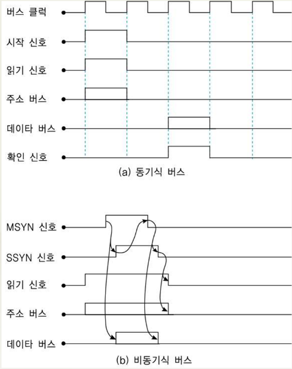

## 시스템 버스, I/O 및 인터럽트

*   시스템 버스?

    *   컴퓨터시스템의 구성 요소들을 상호연결해주는 중심 통로
        *   CPU, 기억 장치, I/O 장치
    *   버스(bus) : 구성 요소들간에 교환할 각종 정보들을 전송하는 선 (line) 들로 구성
    *   버스 선의 수
        *   한 번에 전송하는 데이터 비트들의 수, 기억장치 주소 비트들의 수 및 제어 신호들의 수에 따라 결정
        *   소형 컴퓨터는 50~100개의 신호선들 사용, 중대형급 시스템은 100개 이상의 신호선들 사용

*   기능에 따른 버스의 종류

    *   데이터 버스(data bus)
        *   시스템 요소들 사이에 데이터를 전송하는 데 사용되는 선들의 집합
        *   양방향 전송 (bidirectional transfer)
        *   버스 폭(선들의 수) = CPU와 기억장치 사이에 한 번에 전송되는 비트 수
    *   주소 버스(address bus)
        *   CPU가 기억장치로 (또는 기억장치로부터) 데이터 쓰기 (또는 읽기) 동작을 할 때, 해당 기억장소를 지정하는 주소를 전송하기 위한 선들의 집합
        *   단방향 전송(unidirectional transfer) : CPU -> 기억장치 및 I/O 제어기
        *   주소 버스의 비트 수에 의해 시스템에 접속될 수 있는 전체 기억장치 용량이 결정
        *   직접 주소지정 할 수 있는 기억장소의 단위 : 바이트(byte) 혹은 단어(word)
    *   제어 버스(control bus)
        *   CPU와 기억장치 및 I/O 장치 사이에 제어 신호들을 전송하는 선들의 집합

*   주소 버스의 폭(비트 수)에 따른 기억장치 용량 예

    *   주소 버스 = 16비트인 경우
        *   주소지정 가능한 최대 기억장치들의 수 : 2^16 = 65,536(64K)개
        *   바이트 단위 주소 지정일 경우 최대 기억장치 용량 = 64Kbyte
    *   주소 버스 = 24비트인 경우
        *   최대 2^24 = 16,777,216(16M)개
        *   바이트 단위 주소 지정일 경우 최대 기억장치 용량 = 16Mbyte

*   제어 버스의 주요 제어 신호들

    *   기억장치 쓰기/읽기 신호
    *   입출력 쓰기/읽기 신호
    *   전송 확인 신호

*   중재 버스(arbitration bus)

    *   버스 마스터(bus master) : 시스템 버스에 접속되는 요소들 중에서 버스 사용의 주체가 되는 요소들
        *   CPU, 기억장치 모듈, I/O 제어기 등..
    *   버스 중재(bus arbitration) : 시스템 버스에 접속된 두 개 또는 그 이상의 버스 마스터들이 동시에 버스를 사용하고자 할 때 순서대로 한 개의 마스터씩 버스를 사용할 수 있게 해주는 동작
    *   중재 버스 : 버스 중재를 위한 신호 선들의 집합
        *   버스 요구(bus request) 신호 : 버스 마스터가 버스 사용을 요구했음을 알리는 신호
        *   버스 승인(bus grant) 신호 : 버스 사용을 요구한 마스터에게 사용을 허가하는 신호
        *   버스 사용중(bus busy) 신호 : 현재 버스가 사용되고 있는 중임을 나타내는 신호

*   인터럽트 버스(interrupt bus)

    *   인터럽트 메커니즘을 위한 제어 신호선들의 집합
    *   인터럽트 요구(interrupt request) 신호 : I/O 장치가 인터럽트를 요구했음을 알리는 신호
    *   인터럽트 확인(interrupt acknowledge) 신호 : CPU가 인터럽트 요구를 인식했음을 알리는 신호
    *   그 이외의 제어 신호들
        *   버스 클럭(bus clock) : 동기식 버스에서 버스 동작들의 시작 시간을 일치시키기 위하여 제공되는 공통 클럭 신호
        *   리셋(reset) : 모든 시스템 요소들의 동작을 초기화시키는 신호

*   버스 대역폭(bus bandwidth)

    *   버스의 속도를 나타내는 척도

    *   단위 시간당 전송할 수 있는 데이터 양을 나타내며, 버스 클럭의 주기에 의해 결정

    *   예시

        ```
        버스 클럭 주기 : 50 ns(클럭 주파수 20Mhz)
        데이터 버스 폭 : 64bit(8byte)
        버스 대역폭 : 8byte / (50 x 10^-9 sec) = 160 [Mbytes/sec]
        이 버스를 통하여 초당 1억 6천바이트의 데이터 전송 가능.
        ```

    ​

###  시스템 버스의 기본 동작

*   쓰기 동작(write operation) 순서

    *   버스 마스터가 버스 사용권 획득
    *   버스를 통하여 주소와 데이터 및 쓰기 신호 전송

*   읽기 동작(read operation) 순서

    *   버스 마스터가 버스 사용권 획득
    *   주소와 읽기 신호를 보내고, 데이터가 전송되어 올 때까지 대기

*   버스 동작의 타이밍에 따른 버스의 분류

    *   동기식 버스(synchronous bus) : 시스템 버스에서 모든 버스 동작들이 공통의 버스 클럭을 기준으로 발생
    *   비동기식(asynchronous bus) 버스 : 버스 동작들의 발생 시간이 관련된 다른 버스 동작의 발생 여부에 따라 결정

*   동기식 버스와 비동기식 버스의 시간 흐름도

    

*   동기식 / 비동기식 버스의 비교

    *   동기식 버스 장점 : 인터페이스 회로가 간단
    *   동기식 버스 단점 : 버스 클럭의 주기가 가장 오래걸리는 버스 동작의 소요 시간을 기준으로 결정, 클럭 주기보다 더 짧은 시간이 걸리는 버스 동작의 경우에는 동작이 완료된 후에도 다음 주기가 시작될 때까지 대기
    *   비동기식 버스 장점 : 각 버스 동작이 완료 즉시 연관된 다음 동작이 발생하기 때문에 동기식 버스에서와 같이 낭비되는 시간이 없음
    *   비동기식 버스 단점 : 연속적 동작을 처리하기 위한 인터페이스 회로가 복잡
    *   소규모 컴퓨터시스템은 비동기식 버스 사용, 중형급 이상의 시스템은 동기식 버스를 사용.

    ​

####버스 중재 (bus arbitration)

*   버스 경합(bus contention) : 한 개의 시스템 버스에 접속된 여러 개의 버스 마스터들이 동시에 버스 사용을 요구하는 현상
*   버스 중재(bus arbitration) : 버스 경합이 발생하는 경우, 어떤 기준에 따라 버스 마스터들 중에서 한 개씩만 선택하여 순서대로 버스를 사용할 수 있게 해주는 동작
*   버스 중재기(bus arbiter) : 버스를 중재하는 하드웨어 모듈
*   버스 중재 방식의 분류
    *   제어 신호들의 연결 구조에 따른 중재 방식의 분류
        *   병렬 중재 방식 (parallel arbitration scheme) : 각 버스 마스터들이 독립적인 버스 요구 신호와 버스 승인 신호를 발생
            -> 버스 마스터들의 수와 같은 수의 버스 요구 선 및 승인 신호선 필요
        *   직렬 중재 방식 (serial arbitration scheme) : 버스 요구와 승인 신호 선이 각각 한 개씩만 존재하며, 각 신호 선을 버스 마스터들 간에 직렬로 접속하는 방식
    *   버스 중재기의 위치에 따른 분류
        *   중앙집중식 중재 방식 (centralized arbitration scheme)
            *   시스템 내에 버스 중재기가 한 개만 존재하는 방식
            *   버스 마스터들이 발생하는 버스 요구 신호들은 하나의 중재기로 보내짐
            *   중재기는 정해진 중재원칙에 따라 선택한 버스 마스터에게 승인 신호를 발생
        *   분산식 중재 방식 (decentralized arbitration scheme)
            *   여러 개의 버스 중재기들이 존재
            *   일반적으로 각 버스 마스터가 중재기를 한 개씩 가짐
            *   버스 중재 동작이 각 마스터의 중재기에 의하여 이루어지는 방식